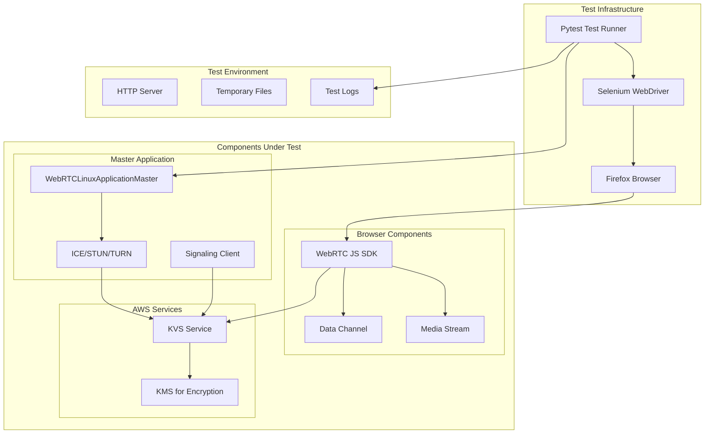
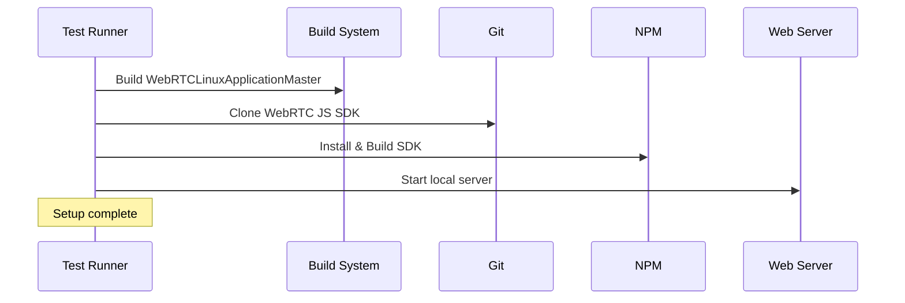
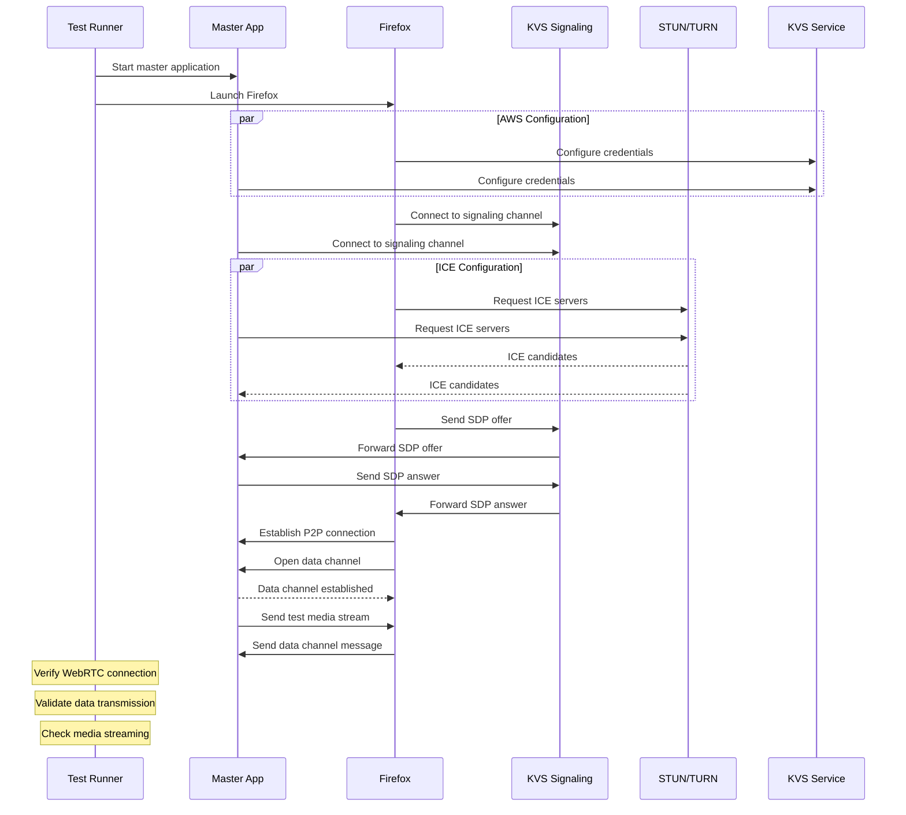
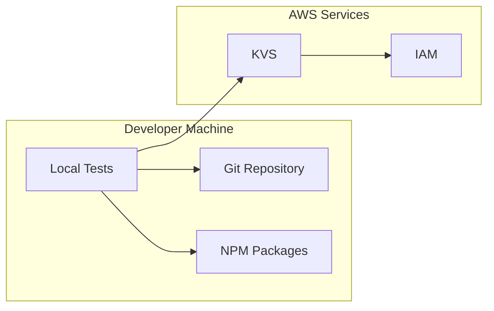
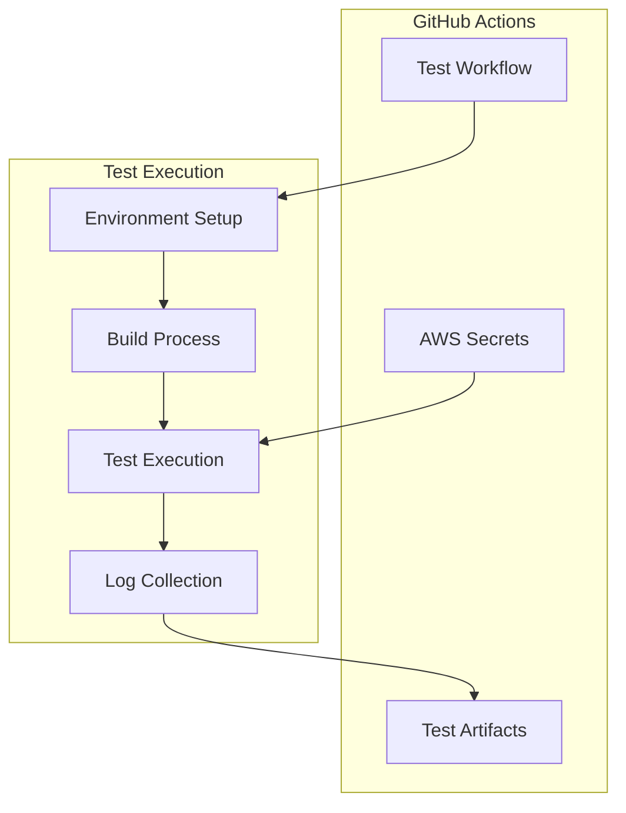

# Testing Approach for Amazon Kinesis Video Streams WebRTC Library

## Overview

This document outlines our comprehensive testing approach for the Amazon Kinesis Video Streams WebRTC library, focusing on automated integration testing using Selenium WebDriver and Pytest. Our approach ensures reliable testing of WebRTC functionality across different components while maintaining reproducibility and ease of maintenance.

## Architecture

### High-Level System Architecture



## Test Components and Flow

### 1. Test Setup Phase



### 2. Test Execution Phase



## Detailed Component Analysis

### 1. Test Infrastructure Components

#### Pytest Framework
- Provides structured test organization
- Handles test fixtures and dependencies
- Manages test lifecycle and cleanup
- Enables parallel test execution

#### Selenium WebDriver
- Automates browser interactions
- Provides stable element selection
- Handles dynamic content loading
- Enables cross-browser testing

### 2. Test Environment Management

#### Local Development


#### CI/CD Integration


## Benefits of This Approach

### 1. Comprehensive Testing
- Tests both C++ master application and JavaScript SDK
- Verifies end-to-end WebRTC functionality
- Validates real browser interactions
- Ensures cross-component compatibility

### 2. Automation and Reliability
- Fully automated test execution
- Reproducible test environment
- Consistent test conditions
- Detailed failure reporting

### 3. Maintainability
- Modular test structure
- Reusable test fixtures
- Clear separation of concerns
- Easy to extend and modify

### 4. CI/CD Integration
- Automated GitHub Actions workflow
- Secure credentials handling
- Preserved test artifacts
- Immediate feedback on changes

## Implementation Details

### 1. Test Structure
```
test/pytest/selenium_tests/
├── requirements.txt    # Python dependencies
├── test_form.py       # Main test file
└── README.md          # Documentation
```

### 2. GitHub Actions Workflow
```
.github/workflows/
└── webrtc-tests.yml   # CI/CD configuration
```

### 3. Key Test Scenarios

#### WebRTC Connection Test
1. Start master application
2. Configure AWS credentials
3. Establish WebRTC connection
4. Verify connection status
5. Clean up resources

#### Data Channel Test
1. Enable data channel
2. Verify channel establishment
3. Test data transmission
4. Validate received data
5. Clean up resources

## WebRTC Testing Considerations

### 1. Connection Establishment
- ICE Candidate Gathering
  * Tests verify proper STUN/TURN server configuration
  * Monitors candidate collection timing
  * Validates ICE connectivity checks

- Signaling Process
  * Tests SDP offer/answer exchange
  * Verifies correct channel connection
  * Monitors signaling state transitions

- Media Stream Handling
  * Tests video stream configuration
  * Validates media quality parameters
  * Monitors stream statistics

### 2. Error Scenarios
- Network Failures
  * Tests connection recovery
  * Validates ICE restart functionality
  * Verifies reconnection behavior

- Authentication Issues
  * Tests invalid credentials handling
  * Validates error message propagation
  * Verifies cleanup on auth failure

- Resource Management
  * Tests proper cleanup of media streams
  * Validates memory usage patterns
  * Monitors resource leaks

### 3. Performance Metrics
- Connection Time
  * Measures ICE gathering duration
  * Tracks signaling completion time
  * Monitors P2P connection establishment

- Media Quality
  * Tracks packet loss statistics
  * Measures bandwidth utilization
  * Monitors frame rate and resolution

- Resource Usage
  * Monitors CPU utilization
  * Tracks memory consumption
  * Measures network bandwidth usage

## Future Enhancements

### 1. Expanded Test Coverage
- Additional browser support
- Network condition simulation
- Error scenario testing
- Performance metrics collection

### 2. Infrastructure Improvements
- Containerized test environment
- Parallel test execution
- Cross-platform testing
- Automated test generation

## Conclusion

This testing approach provides a robust and maintainable solution for validating the Amazon Kinesis Video Streams WebRTC library. By combining automated browser testing with CI/CD integration, we ensure reliable testing of WebRTC functionality while maintaining ease of use and extensibility.

The implementation leverages industry-standard tools and best practices to create a testing framework that can grow with the project's needs. The modular design and comprehensive documentation make it easy for team members to understand, maintain, and extend the test suite as needed.
